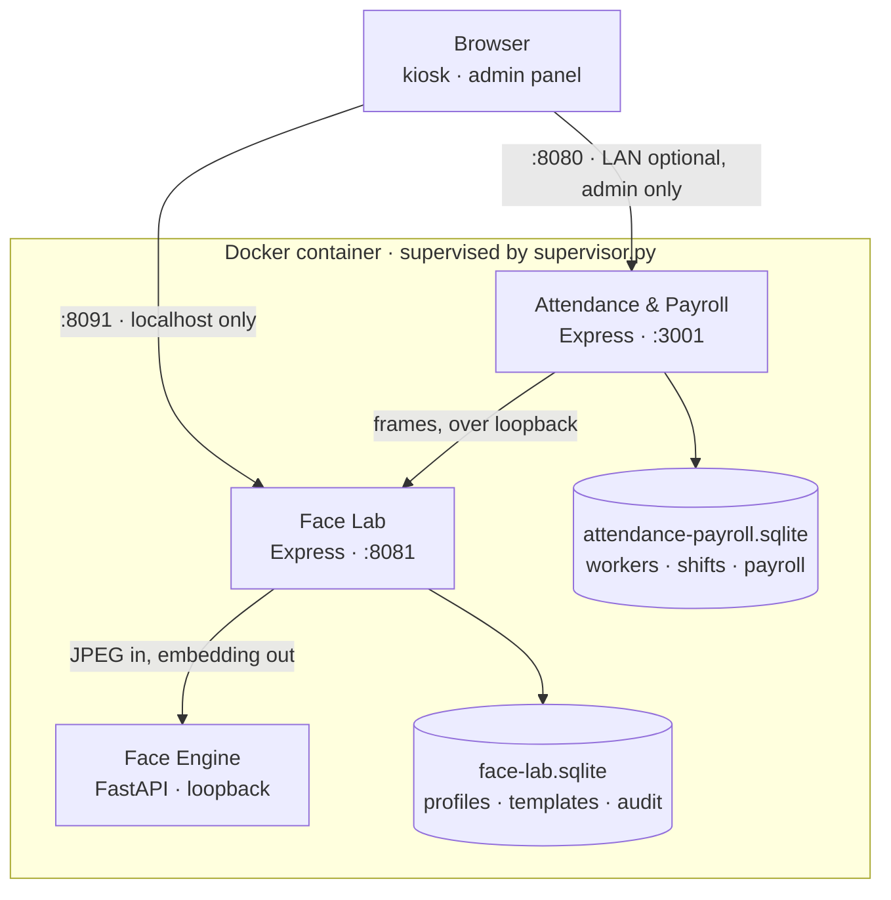

# Biometric Attendance & Payroll

Offline face-recognition attendance and Colombian payroll system running as a single Docker
container.

Workers clock in and out by looking at a camera. The system identifies them against locally
stored face embeddings, records the shift, and turns those shifts into a payroll settlement
that applies Colombian labour rules — ordinary hours, night surcharges, overtime, Sundays and
public holidays — producing a PDF payslip and a CSV export.

Everything runs on the machine where it is installed. There is no cloud service, no external
API and no internet requirement at runtime: face detection, embedding extraction, matching and
payroll all execute locally, and the biometric data never leaves the host. The deployment is
one container with three supervised processes and two SQLite databases on a Docker volume.

This repository is the source of a system built for a real small business. It contains no
customer data, no branding and no production databases — see [Repository scope](#repository-scope).

---

## What it does

- **Facial attendance** — enrolment with consent and active challenges, then 1:N identification
  from four automatic frontal samples. PIN fallback after three failed attempts.
- **Employee and schedule management** — workers, weekly rest day, shift history, bonuses and
  manual deductions.
- **Clock-in / clock-out** — server-timed entries and exits, duplicate entry rejected, exit
  without an open shift rejected.
- **Colombian payroll calculation** — eight pay categories with legal multipliers, holidays
  derived from Easter with the Emiliani transfer rule, contribution base and solidarity fund.
- **PDF payslips and CSV export** — generated locally with an embedded typeface.
- **Offline-first deployment** — a single image, installed from a package on a machine that
  never downloads anything.

## Architecture



Two Express services, each owning its own database: the lab owns biometric profiles, templates,
challenges and consent; attendance owns workers, shifts and settlements, and links to a face
profile by id. The Python engine holds no state — it receives an ephemeral JPEG and returns
detection, quality metrics, landmarks and an embedding.

**No embedding ever reaches the browser.**

## Facial recognition pipeline

1. **Detection** — YuNet (`cv2.FaceDetectorYN`), score threshold 0.85, single face required;
   multiple faces are rejected.
2. **Quality validation** — Laplacian variance for blur, mean illumination, clipped-pixel ratio,
   relative face size and centring, each with its own rejection reason.
3. **Landmarks** — MediaPipe Face Landmarker for pose and eye geometry.
4. **Embeddings** — SFace, 128 dimensions, L2-normalised, validated for size and finiteness.
5. **Matching** — cosine similarity; per profile the two best templates are averaged, and the
   median across the four query frames is the profile score. A match requires passing the
   threshold, beating the runner-up by a configured margin, and agreement across all frames.

**Identification does not implement certified liveness or anti-spoofing.** Active challenges
(blink, left/right turn, validated server-side) exist only during enrolment. The frontal
identification flow was an explicit product decision and records `liveness_passed=0`; it offers
less protection against a photo or video than the active challenge does. See
[`docs/IDENTIFICATION_UX_CHANGE.md`](docs/IDENTIFICATION_UX_CHANGE.md).

## Payroll

Shifts become money through eight categories: ordinary day hours, ordinary night surcharge,
day and night overtime, Sunday/holiday work and its night variant, and Sunday/holiday overtime
in both variants. On top of that the settlement applies:

- the first seven hours of each day as ordinary, the rest as overtime;
- the statutory weekly maximum, which varies by date;
- Colombian public holidays computed from Easter and moved to Monday where the Emiliani law
  applies;
- transportation allowance, excluded from the contribution base and withdrawn above the legal
  income ceiling;
- contribution base and solidarity fund rate;
- salary and non-salary bonuses, with the non-salary excess over 40% carried into the base;
- manual deductions.

Rules are implemented against Colombian regulations for a documented reference period — see
[`docs/AUDITORIA_NOMINA_COLOMBIA_2026.md`](docs/AUDITORIA_NOMINA_COLOMBIA_2026.md), which
records the parameters and the date they were contrasted. **This is an implementation, not a
legal certification**, and the parameters expire when the law changes.

## Engineering highlights

- **Explicit domain separation** carried down to persistence: two SQLite databases with distinct
  owners, rather than one schema shared by convenience.
- **Biometric data never sent to the browser**; JPEGs are ephemeral and no face image is stored.
- **Deterministic model provisioning**: weights are fetched from pinned upstream revisions and
  verified by SHA-256 against a manifest — and, for the OpenCV models, against the published
  Git LFS object id.
- **Non-root, read-only container** with `cap_drop: ALL`, `no-new-privileges`, memory and CPU
  limits, loopback-only ports by default and an external volume that `compose down -v` cannot
  delete.
- **Test coverage concentrated on high-risk logic**: payroll arithmetic, face-attendance rules
  and the matching/liveness layer, rather than on UI breadth.
- **Audit trails** in both databases, with identification logs retained for 30 days and removed
  with the profile they belong to.
- **Documented limits**: the architecture document states what the system does *not* guarantee,
  including the absence of biometric encryption at rest.

## Stack

| Layer | Technology |
|---|---|
| Frontend | React 19, TypeScript, Vite |
| Backend | Node (24 and 22), Express 5, zod, bcryptjs |
| Vision | Python 3.12, FastAPI, OpenCV 4.13 (YuNet, SFace), MediaPipe 0.10 |
| Persistence | SQLite via better-sqlite3 — WAL, foreign keys, `secure_delete`, versioned migrations |
| Deployment | Single multi-stage Docker image, supervised processes, offline install package |
| Testing | vitest, node:test, unittest |

## Running locally

Model weights are not stored in this repository. Provision them first — the script downloads
from the pinned sources in `face-service/models/manifest.json` and verifies every SHA-256:

```bash
python scripts/prepare-models.py
```

Then build and run the container:

```bash
docker build --pull=false -f Dockerfile.unified -t biometric-attendance-payroll:1.0.0 .
docker compose up -d
```

The attendance UI is at `http://localhost:8080`; the face lab at `http://localhost:8091`, bound
to localhost only. The first administrator is created through an interactive CLI inside the
container — there is no default password and no public setup endpoint.

For development outside Docker, each Node project installs with `npm ci` in its own directory
(`.` for the lab, `turnos-app/` for attendance). On Windows, `better-sqlite3` compiles from
source and needs the Visual Studio Build Tools; the Docker build installs `python3 make g++`
for exactly that reason.

## Testing

```bash
npm test                    # face lab: node:test
cd turnos-app && npm test   # attendance and payroll: vitest
python scripts/test-face-service.py   # face engine, inside a disposable container
python scripts/test-unified.py        # full flow, disposable container and volume
```

Results verified while preparing this repository, on Windows with Node 24 and Python 3.12:

- attendance and payroll — **39 passed** (24 payroll cases, 14 face-attendance, 1 holidays);
- face engine — **15 passed** against the real models, after provisioning;
- lint, typecheck and production build of the attendance app — passing.

The face lab's Node suite was not run outside Docker on that machine: `better-sqlite3` could not
compile without the Visual Studio Build Tools.

## Security & privacy

- No face images or video are stored; frames are processed in memory and discarded.
- Embeddings stay in the local SQLite database and are never returned to the browser.
- Administrator passwords are hashed with bcrypt (cost 12); session tokens are random 256-bit
  values stored as SHA-256 hashes, in `HttpOnly`, `SameSite=Strict` cookies with expiry.
- Requests are rejected by `Sec-Fetch-Site` and an exact origin allow-list; rate limits apply
  globally and to login specifically.
- The container runs as an unprivileged user, read-only, without capabilities.

Limits worth stating plainly:

- **Embeddings are not encrypted at rest by the application.** Disk encryption on the host is
  the storage boundary.
- **Identification lacks certified anti-spoofing** (see above).
- **Backups live in the same Docker volume as the data**, which protects against accidental
  deletion but not against losing the disk. An external backup strategy is required.

## Limitations

- No certified liveness during identification; the active challenge exists only at enrolment.
- **Biometric accuracy is not claimed.** The tests verify behaviour, not population accuracy;
  measuring that needs a labelled set of real volunteers.
- SQLite was chosen for a small single-site deployment with hundreds of profiles, not for scale.
- Payroll rules are time-sensitive and tied to a documented reference period.
- Application-level biometric encryption is not implemented.
- An external, off-device backup strategy is recommended and not provided here.
- The interface and documentation are in Spanish, the language of the deployment.

## Repository scope

This repository contains source code only:

- no real employee data, no shifts, no settlements;
- no real biometric templates or embeddings;
- no customer branding, logos or identifying names;
- no production or demo databases — `runtime/` is git-ignored and ships empty;
- model weights are provisioned separately from upstream sources, not vendored here.

Demo data can be generated locally with `scripts/seed-demo-data.mjs`, which uses entirely
fictional records and refuses to run against a database that already holds data.

<!-- Screenshots, when added, belong in docs/images/ and are generated from demo data only. -->

## Documentation

See [`docs/README.md`](docs/README.md) for the index. The most useful starting points are
[`docs/ARCHITECTURE.md`](docs/ARCHITECTURE.md) for the design and its limits, and
[`docs/FACE_IDENTIFICATION.md`](docs/FACE_IDENTIFICATION.md) for the matching strategy.

## License

No project-wide license is granted at this time. Third-party components retain their respective
licenses; see [`THIRD_PARTY_NOTICES.md`](THIRD_PARTY_NOTICES.md) and
`face-service/models/manifest.json` for model licenses, sources and hashes.
